# Appointments App

#### [Live Demo](http://)

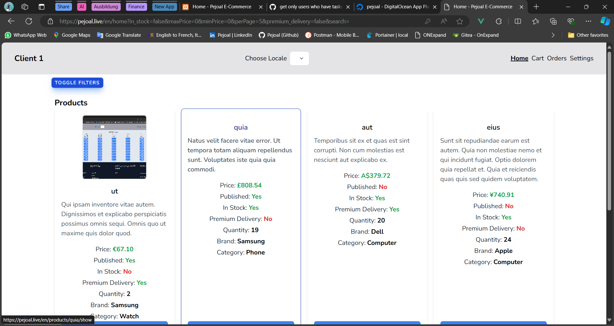
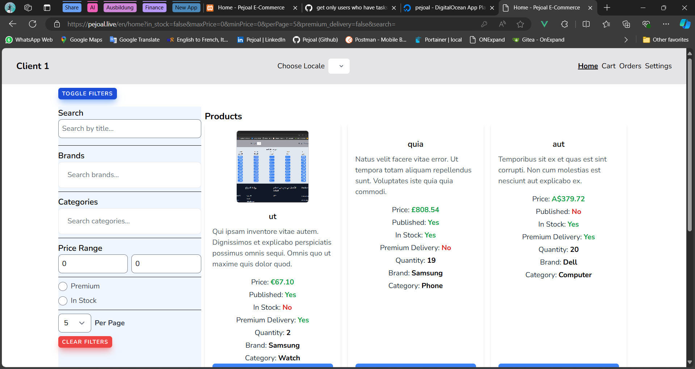
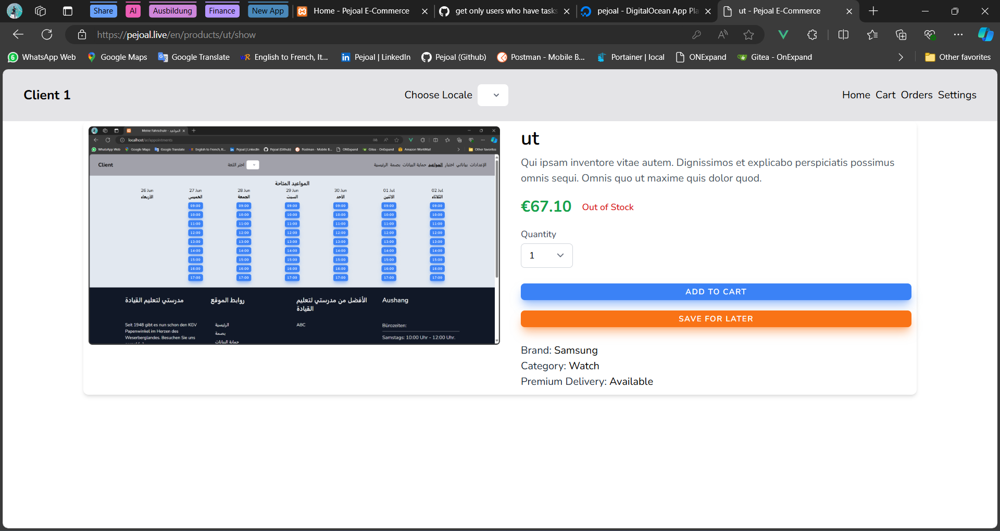
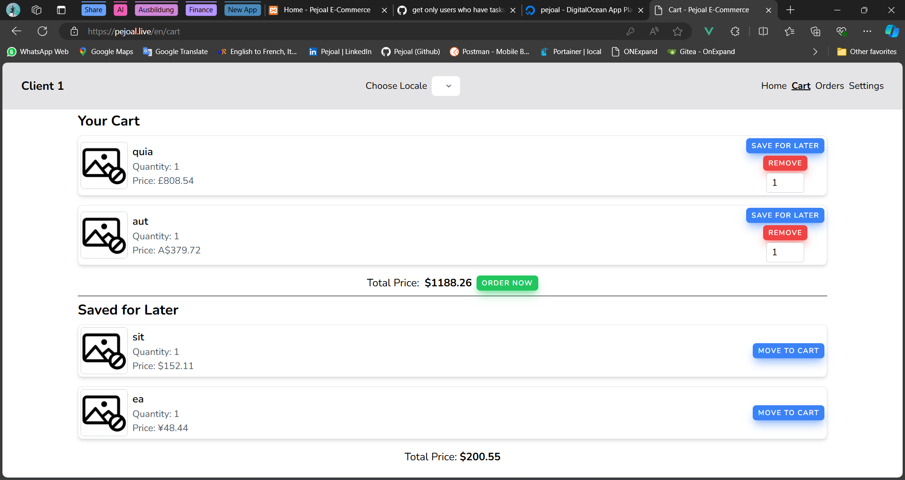
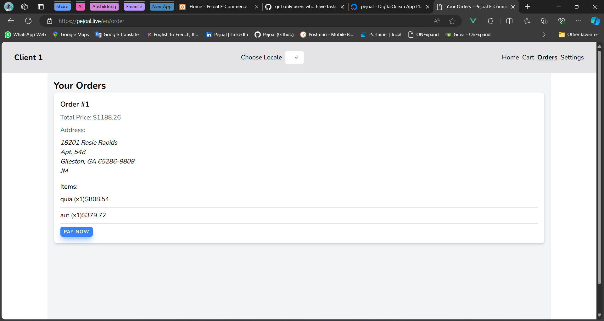
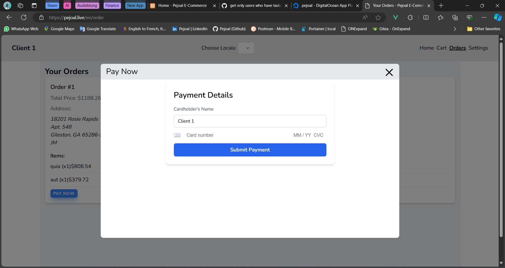
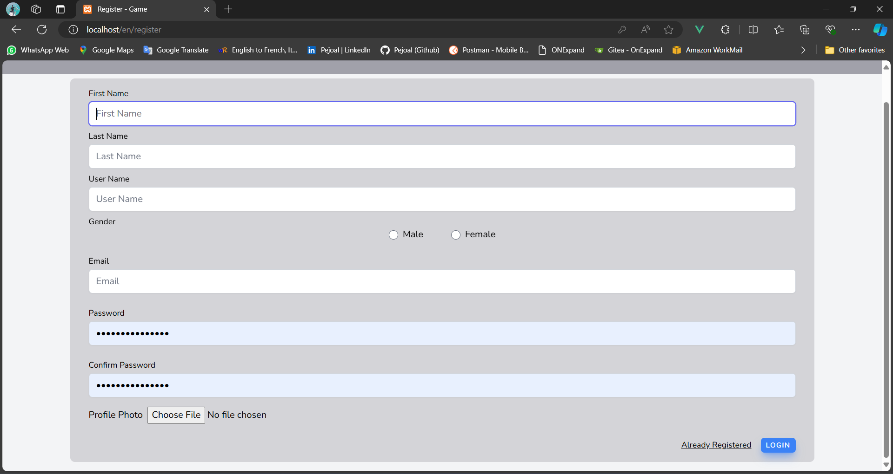
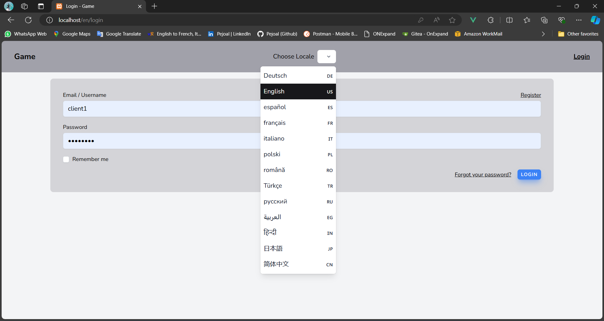
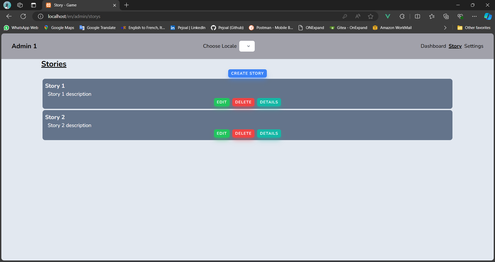
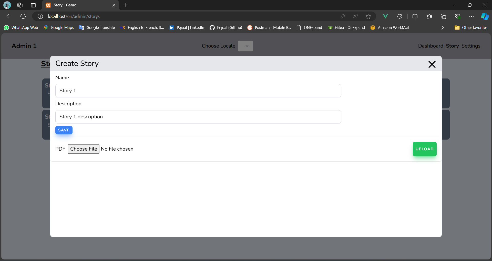
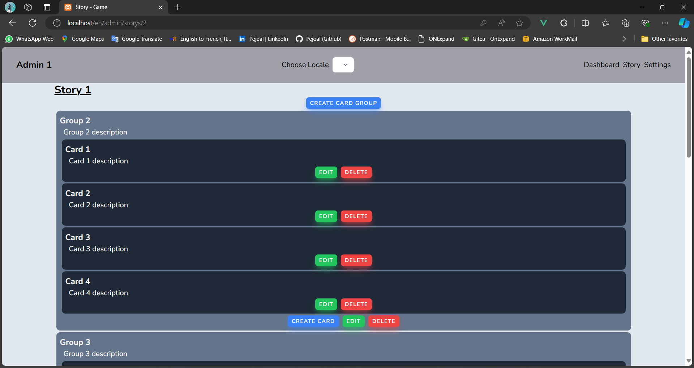
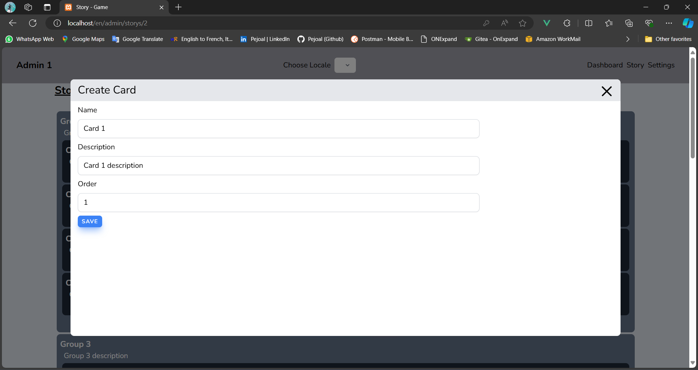
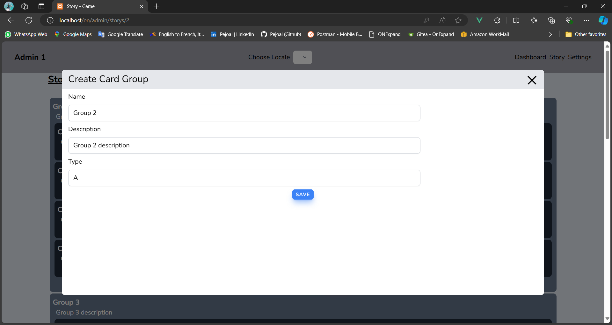
---

## Authors

- [@Pejoal](https://www.github.com/Pejoal)

---

## Installation

```shell
git clone git@github.com:Pejoal/Game.git
```

```shell
cd Game
```

```shell
cp .env.example .env
```

- Don't forget to Fill .env with your keys

---

### Front-End

- #### Install NVM
```shell
curl -o- https://raw.githubusercontent.com/nvm-sh/nvm/v0.39.4/install.sh | bash
```

```shell
export NVM_DIR="$([ -z "${XDG_CONFIG_HOME-}" ] && printf %s "${HOME}/.nvm" || printf %s "${XDG_CONFIG_HOME}/nvm")"
[ -s "$NVM_DIR/nvm.sh" ] && \. "$NVM_DIR/nvm.sh"
```

```shell
nvm install 19.1.0
```


```shell
npm install
```

---

### Back-End

- #### Install Composer V2 at Least, Then


```shell
composer require laravel/sail --dev --ignore-platform-reqs
```

```shell
alias sail="./vendor/bin/sail"
```

```shell
sail up -d
```

```shell
sail composer install --ignore-platform-reqs
```


```shell
sail artisan storage:link
```

```shell
sail artisan key:generate
```

```shell
sail artisan migrate:fresh --seed
```

```shell
npm run dev
```

#### Don't Forget to Add .env Secrets

### Database

- Username: pejoal
- Password: pejoal

---

## Redis

- command to subscribe to a redis test channel (route: http://localhost/en/publish)
```shell
sail artisan redis:subscribe
```

---

### Features

1. Register System Included ( Email / Username )
> - Email Must Be Verified
> - Forget Password ( Sending Reset Password Email Functionality )

---

### Prerequisites

- Composer ( V 2 )
- Node js ( V 19.1.0 )
- Docker ( Compose )

---

### Stack

- PHP ( 8.2 )
- Laravel 10 ( Sail )
- MySQL ( MariaDB )
- Inertia js
- Vue 3 ( Composition API )
- Tailwind CSS

---

## For Support.. 

- [My Email](pejoal.official@gmail.com)
